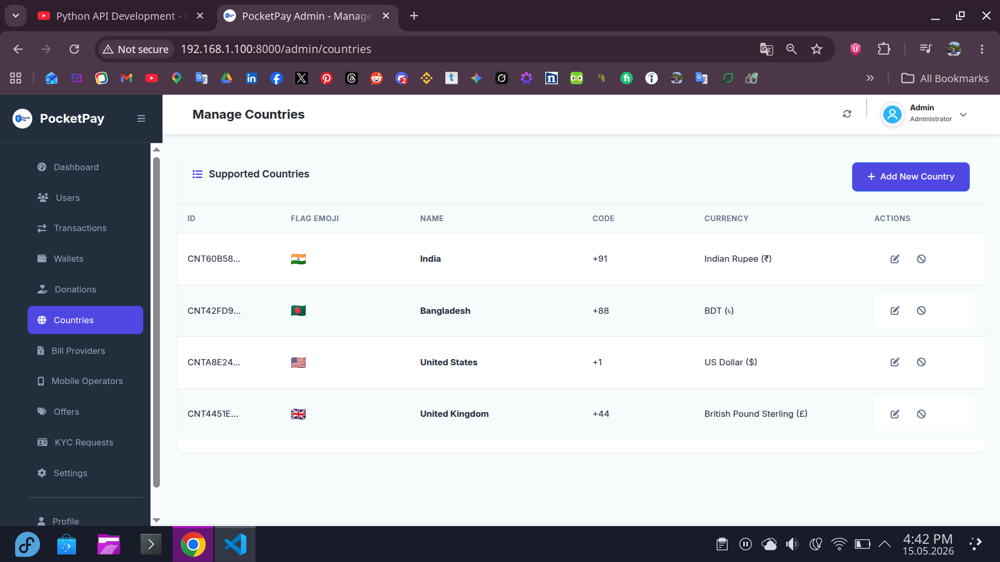
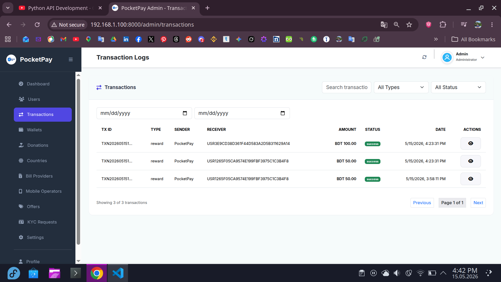
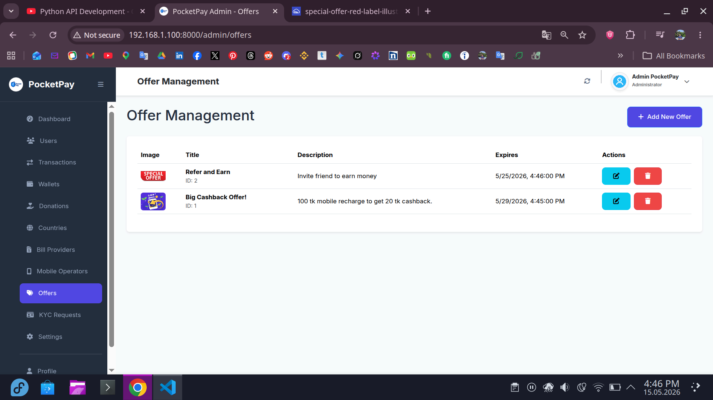
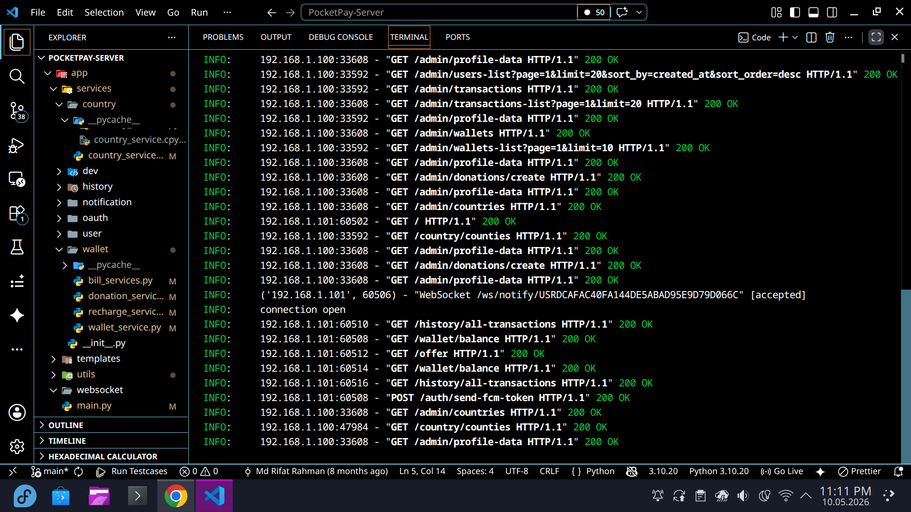
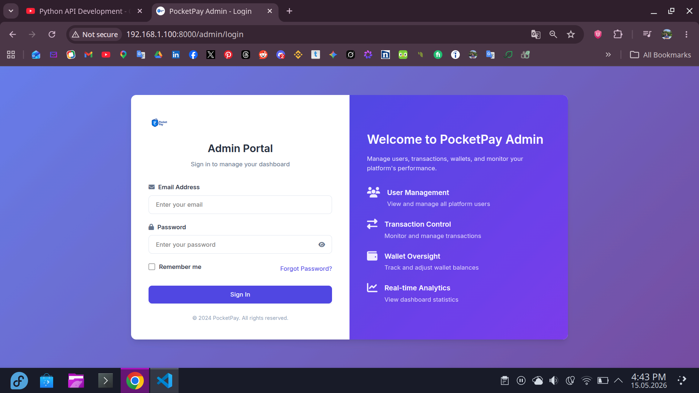

# PocketPay Server

PocketPay Server is a FastAPI backend for a digital wallet and payment platform. It brings together authentication, wallet operations, peer-to-peer transfers, mobile recharge, bill payments, donations, bank transfers, QR generation, real-time notifications, offers, KYC flows, and an admin dashboard in one API-first project.

<!--  -->

## Highlights

- Complete wallet backend with balance lookup, send money, transaction details, and service charges
- Secure authentication with JWT access/refresh tokens, Google login, OTP verification, password reset, and optional two-factor authentication
- Payment services for mobile recharge, utility bills, donations, pocket-to-bank, and bank-to-pocket flows
- Admin dashboard for users, wallets, transactions, refunds/cancellations, KYC requests, offers, notifications, and admin management
- Real-time notification support with WebSocket endpoints and Firebase Cloud Messaging token handling
- Cloudinary-based profile image upload support
- Docker and setup script included for faster local onboarding

## Screenshots

| Admin Dashboard | User Management | Transactions |
| --- | --- | --- |
|  |  |  |
|  |  |  |

## Tech Stack

- **FastAPI** for the API application
- **SQLAlchemy** for ORM and database access
- **SQLite** for local development storage
- **Pydantic** for request and response validation
- **python-jose** for JWT handling
- **Passlib bcrypt** for password hashing
- **PyOTP** for TOTP-based two-factor authentication
- **Firebase Admin SDK** for push-notification integration
- **Jinja2 templates** and Bootstrap assets for the admin dashboard
- **Cloudinary** for image uploads
- **Docker** for containerized setup

## Project Structure

```text
PocketPay-Server/
|-- admin/                 # Admin authentication and management routes
|-- app/
|   |-- constants/         # Environment and shared constants
|   |-- core/              # Database configuration
|   |-- dependencies/      # Shared FastAPI dependencies
|   |-- middleware/        # Authentication middleware
|   |-- model/             # SQLAlchemy models
|   |-- router/            # API route modules
|   |-- schema/            # Pydantic schemas
|   |-- services/          # Business logic
|   |-- templates/         # Email, SMS, and push templates
|   `-- utils/             # Auth, hashing, notification, and helper utilities
|-- public/                # Project images and screenshots
|-- static/                # Admin dashboard static files
|-- templates/             # Admin dashboard HTML templates
|-- Dockerfile             # Docker configuration
|-- docker-compose.yml     # Docker Compose service definition
|-- setup.sh               # Automated local setup script
|-- run.py                 # Local development runner
|-- requirements.txt       # Python dependencies
`-- README.md
```

## Getting Started

### Prerequisites

- Python 3.10 or newer
- `pip`
- A virtual environment tool such as `venv`
- Docker and Docker Compose, if you prefer containerized setup

> This project is designed for Python 3.10+. Docker is the easiest way to avoid local environment differences.

### Quick Start with Setup Script

```bash
chmod +x setup.sh
./setup.sh
```

The setup script can create a `.env` file, install dependencies, and guide you through either Docker or manual setup.

### Docker Setup

```bash
docker compose up -d
```

If your machine uses the older Compose CLI, use:

```bash
docker-compose up -d
```

The app will be available at `http://localhost:8000`.

### Manual Installation

1. Clone the repository:

   ```bash
   git clone https://github.com/rifatsoftdev/PocketPay-Server.git
   cd PocketPay-Server
   ```

2. Create a `.env` file in the project root:

   ```env
   # Database Configuration
   DATABASE_URL=sqlite:///./pocketpay.db
   SUPABASE_URL=your-supabase-url
   SUPABASE_KEY=your-supabase-key

   # Email Configuration (SMTP)
   EMAIL_ADDRESS=your-email@example.com
   EMAIL_PASSWORD=your-email-password
   SMTP_SERVER=smtp.gmail.com
   SMTP_PORT=587
   EMAIL_USE_TLS=True
   EMAIL_USE_SSL=False

   # Google OAuth
   GOOGLE_CLIENT_ID=your-google-client-id

   # JWT Authentication
   SECRET_KEY=change-this-secret-key
   ALGORITHM=HS256
   ACCESS_EXPIRE=30
   REFRESH_EXPIRE=10080

   # OTP and Password Reset
   OTP_TOKEN_EXPIRE_MIN=5
   PASS_RST_TOKEN_EXPIRE_MIN=15

   # Rewards and Service Charge
   NEW_USER_REWARD_WITH_REFERRAL=0
   NEW_USER_REWARD_WITH_NO_REFERRAL=0
   USER_REFERRAL_REWARD=0
   SERVICE_CHARGE=0

   # Application Settings
   VERSION=1.0.0
   DEBUG=True

   # Cloudinary
   CLOUDINARY_CLOUD_NAME=your-cloudinary-cloud-name
   CLOUDINARY_API_KEY=your-cloudinary-api-key
   CLOUDINARY_API_SECRET=your-cloudinary-api-secret

   # Security and Firebase
   SALT=change-this-salt
   SERVICE_ACCOUNT_PATH=path/to/firebase-service-account.json

   # Default Admin Credentials
   DEFAULT_ADMIN_EMAIL=admin@example.com
   DEFAULT_ADMIN_PHONE=+8801000000000
   DEFAULT_ADMIN_PASSWORD=admin-password
   DEFAULT_ADMIN_NAME=Admin

   # Default Test User Credentials
   DEFAULT_USER_EMAIL=user@example.com
   DEFAULT_USER_PHONE=+8801000000001
   DEFAULT_USER_PASSWORD=user-password
   DEFAULT_USER_NAME=User
   ```

3. Create and activate a virtual environment:

   ```bash
   python3 -m venv venv
   source venv/bin/activate
   ```

   On Windows:

   ```bash
   venv\Scripts\activate
   ```

4. Install dependencies:

   ```bash
   pip install -r requirements.txt
   ```

5. Start the development server:

   ```bash
   python run.py
   ```

   Or use Uvicorn directly:

   ```bash
   uvicorn app.main:app --reload --host 0.0.0.0 --port 8000
   ```

## API Documentation

After starting the server, open:

- Swagger UI: `http://localhost:8000/docs`
- Admin login: `http://localhost:8000/admin/login`
- Terms and conditions: `http://localhost:8000/terms-and-conditions`

## Main API Routes

### Authentication

- `POST /auth/register`
- `POST /auth/final-setup`
- `POST /auth/login`
- `POST /auth/google-login`
- `POST /auth/link-google`
- `POST /auth/logout`
- `POST /auth/logout-all`
- `POST /auth/new-access-token`
- `POST /auth/send-otp`
- `POST /auth/verify-otp`
- `POST /auth/reset-password`
- `GET /auth/reset-password/{password_token}`
- `POST /auth/set-password`
- `POST /auth/change-password`
- `POST /auth/totp-setup`
- `POST /auth/totp-confirm`
- `POST /auth/totp-disable`
- `POST /auth/email-tfa-setup`
- `POST /auth/email-tfa-confirm`
- `POST /auth/email-tfa-disable`
- `POST /auth/send-fcm-token`
- `POST /auth/delete-account`
- `POST /auth/cancel-delete`

### User

- `GET /user/profile`
- `GET /user/edit-info`
- `POST /user/profile/update`
- `POST /user/image-upload`
- `POST /user/kyc/submit`

### Wallet

- `GET /wallet/balance`
- `POST /wallet/sent-money`
- `GET /wallet/transaction-details/{transaction_id}`

### Bank

- `GET /bank/banks`
- `POST /bank/pocket2bank`
- `POST /bank/bank2pocket`

### Transaction History and Notifications

- `GET /history/all-transactions`
- `POST /history/all-notifications`
- `WebSocket /ws/notify/{user_id}`

### Mobile Recharge

- `GET /recharge/operators`
- `POST /recharge/recharge`
- `POST /recharge/new-operator`
- `POST /recharge/deactivate-operator`
- `POST /recharge/activate-operator`

### Bill Payment

- `GET /bill/providers`
- `GET /bill/providers/{category}`
- `POST /bill/pay-bill`
- `POST /bill/new-provider`

### Donations

- `GET /donation/organization`
- `POST /donation/donate`
- `POST /donation/new-organization`
- `POST /donation/remove-organization`
- `PUT /donation/organization-edit/{organization_id}`

### Countries and QR

- `GET /country/counties`
- `POST /country/add-new-country`
- `PUT /country/country-edit/{country_id}`
- `POST /country/inactive-country`
- `POST /country/active-country`
- `POST /qr/generate-qr`

### Offers

- `GET /offer/offers`
- `GET /offer/offers/{offer_id}`
- `POST /offer/add-offer`
- `PUT /offer/edit-offer`
- `DELETE /offer/delete-offer/{offer_id}`

### Developer Payment

- `POST /dev/make-payment`
- `WebSocket /dev/connect/{user_id}`
- `POST /dev/request-developer`
- `POST /dev/cancel-developer`

### Admin

- `POST /admin/login`
- `POST /admin/logout`
- `POST /admin/refresh`
- `GET /admin/profile-data`
- `PUT /admin/profile`
- `POST /admin/create`
- `GET /admin/list`
- `PUT /admin/{admin_id}`
- `POST /admin/{admin_id}/reset-password`
- `DELETE /admin/{admin_id}`
- `POST /admin/change-password`
- `GET /admin/dashboard/stats`
- `GET /admin/users-list`
- `GET /admin/transactions-list`
- `GET /admin/transactions/{transaction_id}`
- `POST /admin/transactions/{transaction_id}/cancel`
- `GET /admin/wallets-list`
- `GET /admin/list-kyc-request`
- `GET /admin/kyc-request-details/{user_id}`
- `POST /admin/update-kyc-request`
- `POST /admin/users/{user_id}/notify`

## Response Format

Most API responses follow this shape:

```json
{
  "success": true,
  "message": "Operation completed successfully",
  "data": {},
  "pagination": null
}
```

Error responses use the same `success` and `message` pattern with an appropriate HTTP status code.

## Database

The project currently uses SQLite for local development:

```text
sqlite:///./pocketpay.db
```

Tables are created automatically when the application starts. For production, configure a production database and a migration workflow before deployment.

## Security Notes

- Keep `.env`, database files, service account files, and other secrets out of Git.
- Replace all example credentials before running the app in any shared environment.
- Restrict CORS origins before production deployment.
- Use HTTPS in production.
- Rotate `SECRET_KEY` and provider credentials if they are ever exposed.

## Testing

Tests are not fully configured yet. Add project tests under `test/` and run them with your preferred test runner.

## Deployment Checklist

- Configure secure environment variables
- Use a production ASGI setup such as Uvicorn behind Gunicorn or a process manager
- Replace SQLite with PostgreSQL, MySQL, or another production database
- Configure CORS for trusted domains only
- Configure email, Cloudinary, Google OAuth, and Firebase service account credentials
- Add monitoring, logging, backups, and database migrations

## License

This project is licensed under the MIT License. See [LICENSE](LICENSE) for details.

## Contact

Feel free to connect with me:

- Email: rifatsoft.dev@gmail.com
- GitHub: [rifatsoftdev](https://github.com/rifatsoftdev)
- Portfolio: [rifatsoftdev](https://rifatsoftdev.netlify.app/)
- LinkedIn: [Md Rifat Rahman](https://www.linkedin.com/in/rifatsoftdev/)
- Instagram: [@rifatsoftdev](https://www.instagram.com/rifatsoftdev/)
- LeetCode: [@rifatsoftdev](https://leetcode.com/u/rifatsoftdev/)
